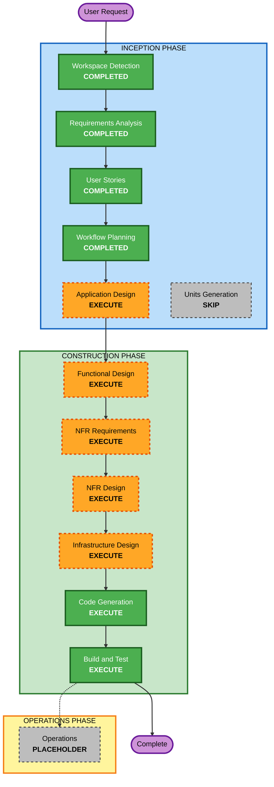

# Execution Plan — EduCore ERP MVP

## Detailed Analysis Summary

### Change Impact Assessment
- **User-facing changes**: Yes — 3 user roles with distinct UI workflows (Admin, Registrar, Finance)
- **Structural changes**: Yes — new greenfield system with modular monolith architecture
- **Data model changes**: Yes — new PostgreSQL schema (organizations, users, students, enrollments, billing, payments, audit logs)
- **API changes**: Yes — new REST API (NestJS) with ~25 endpoints across 7 modules
- **NFR impact**: Yes — DPA compliance (encryption, audit trails), Supabase Auth integration, security headers

### Risk Assessment
- **Risk Level**: Medium
- **Rollback Complexity**: Easy (greenfield, no existing system to break)
- **Testing Complexity**: Moderate (enrollment workflow, billing lifecycle, RBAC, DPA compliance)
- **Timeline Risk**: High (3 months with 2-3 devs for a full ERP MVP, mitigated by bare-minimum scope)

## Workflow Visualization



### Text Alternative
```
INCEPTION PHASE:
  1. Workspace Detection      -> COMPLETED
  2. Requirements Analysis    -> COMPLETED
  3. User Stories             -> COMPLETED
  4. Workflow Planning        -> COMPLETED
  5. Application Design      -> EXECUTE
  6. Units Generation        -> SKIP

CONSTRUCTION PHASE (single unit):
  7. Functional Design       -> EXECUTE
  8. NFR Requirements        -> EXECUTE
  9. NFR Design              -> EXECUTE
  10. Infrastructure Design  -> EXECUTE
  11. Code Generation        -> EXECUTE (ALWAYS)
  12. Build and Test         -> EXECUTE (ALWAYS)

OPERATIONS PHASE:
  13. Operations             -> PLACEHOLDER
```

## Phases to Execute

### INCEPTION PHASE
- [x] Workspace Detection (COMPLETED)
- [x] Reverse Engineering (SKIPPED — Greenfield)
- [x] Requirements Analysis (COMPLETED)
- [x] User Stories (COMPLETED)
- [x] Workflow Planning (COMPLETED)
- [ ] Application Design — **EXECUTE**
  - **Rationale**: New system requires component identification, service layer design, and dependency mapping. 7+ modules (auth, org, student, enrollment, billing, audit, reporting) need clear boundaries and interfaces defined before coding.
- [ ] Units Generation — **SKIP**
  - **Rationale**: This is a modular monolith with a single deployable unit. No microservice decomposition needed. Module boundaries are defined in Application Design. The entire app is one unit of work.

### CONSTRUCTION PHASE (Single Unit: EduCore MVP)
- [ ] Functional Design — **EXECUTE**
  - **Rationale**: Complex business logic: enrollment state machine (Draft->Submitted->Approved->Enrolled/Rejected->Resubmit), billing lifecycle (Unpaid->Partially Paid->Fully Paid), bulk billing generation, DPA consent tracking. These need detailed design before coding.
- [ ] NFR Requirements — **EXECUTE**
  - **Rationale**: Security extension enabled (blocking). DPA compliance requires encryption, audit trails, input validation, secure auth. Tech stack decisions (NestJS + Nuxt + Supabase + Render) need formal NFR documentation.
- [ ] NFR Design — **EXECUTE**
  - **Rationale**: NFR Requirements will produce security and performance requirements that need to be incorporated into the architecture (middleware patterns, guard patterns, logging infrastructure).
- [ ] Infrastructure Design — **EXECUTE**
  - **Rationale**: Deployment to Render + Supabase + Cloudflare requires infrastructure mapping. Docker configuration, environment variables, CI/CD pipeline, and database migration strategy need design.
- [ ] Code Generation — **EXECUTE** (ALWAYS)
  - **Rationale**: Implementation planning and code generation for the entire MVP.
- [ ] Build and Test — **EXECUTE** (ALWAYS)
  - **Rationale**: Build instructions, test strategy, and verification for the MVP.

### OPERATIONS PHASE
- [ ] Operations — **PLACEHOLDER**
  - **Rationale**: Future deployment and monitoring workflows.

## Estimated Timeline
- **Remaining INCEPTION stages**: 1 (Application Design)
- **CONSTRUCTION stages**: 6 (Functional Design, NFR Req, NFR Design, Infra Design, Code Gen, Build & Test)
- **Total remaining stages**: 7

## Success Criteria
- **Primary Goal**: Working bare-minimum School ERP MVP deployed on Render with enrollment + student management + manual billing
- **Key Deliverables**: NestJS API, Nuxt 3 frontend, PostgreSQL schema, Supabase Auth integration, Docker setup, CI/CD pipeline
- **Quality Gates**: All SECURITY rules compliant, DPA consent implemented, audit trail functional, RBAC enforced on all endpoints
